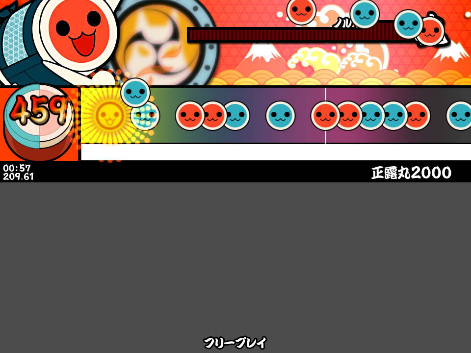

# 太鼓さん十四

Cross platform Gen-2 based TJA player and Taiko simulator powered by Godot.

# Features

- Cross platform (supports anything that Godot can run on)
- Probably performant?
- Can run (most) 太鼓さん次郎 charts (including gimmick charts)
- 4:3 720p, with an aesthetic similar to Gen 2 Taiko (7-14) and the Wii and Portable games

# License

Licensed under MIT.
