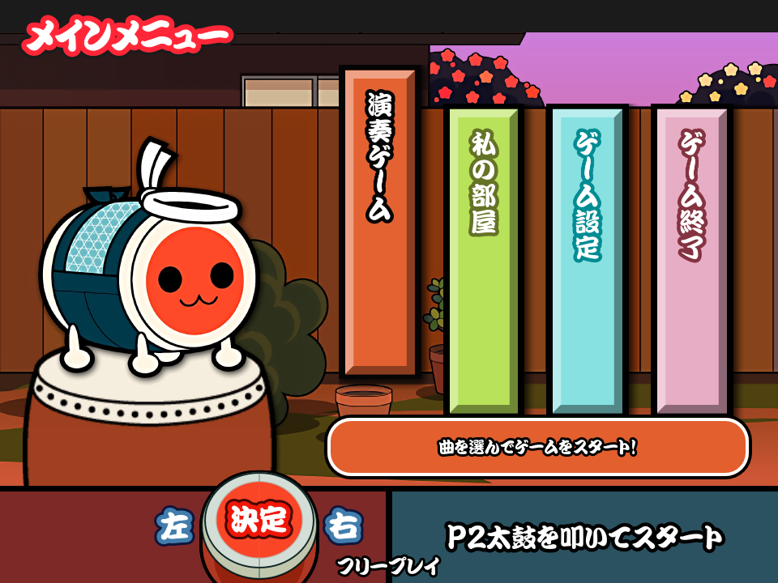
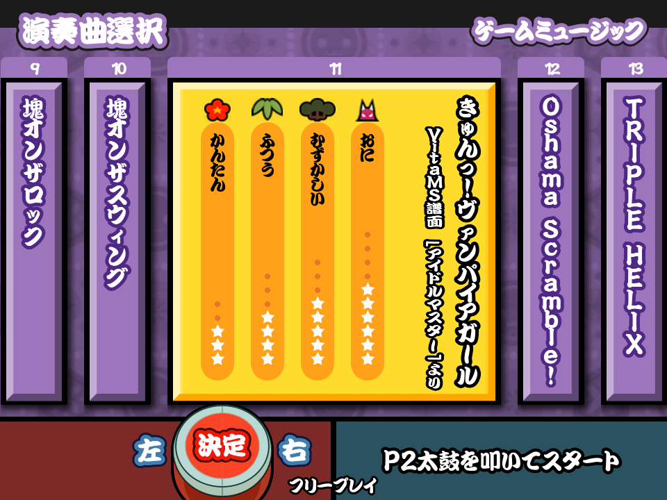

# 太鼓さん十四

Cross platform Gen-2 based TJA player and Taiko simulator powered by [Godot](https://godotengine.org/).

[In-Game](https://github.com/user-attachments/assets/61d2f902-6d81-47c4-b85b-548961ad4f72)

# Features

- Cross platform (supports anything that Godot can run on)
- Probably performant?
- Can run (most) 太鼓さん次郎 charts (including gimmick charts)
- 4:3 720p, with an aesthetic similar to Gen 2 Taiko (7-14), the Wii and Portable games

# Controls

Currently only supports keyboard...

- DFJK for the Taiko itself (P1) (left kat, left don, right don, right kat)
- ERUI for the Player 2 Taiko (WIP; will crash when selected on the entry screen!)

# FAQ

> What Taiko arcade release is this supposed to emulate?
None of them. Or more like all of them, since its an amalgamation of Generation 2 style Taiko in general.

> Are there any plans to make this more accurate to Taiko 14?
No.

> Branches don't work! Everything defaults to the Master branch!
Working on it.

> Why is it always autoplay???
Working on it.

> My sound doesn't work!
I'm primarily working on this on Linux, and so by default in the Project Settings, the sound driver I chose is ALSA.
If you're on Windows or Mac, it should change to a different one, though feel free to change it to WASAPI for minimum latency. (Just don't put this on pull requests or something...)

# Contributing

Contributions are very much welcome! I'm more or so looking for more contributions on the art asset side, as I'm redrawing Gen 2 assets for 720p.

## Requirements

For development of the actual game:

- [Godot 4.6+](https://godotengine.org/)
  - Redot or other Godot forks not supported

For art assets (as seen on the `art-assets/` folder):
- [Inkscape](https://inkscape.org/)

# License

Licensed under MIT.
