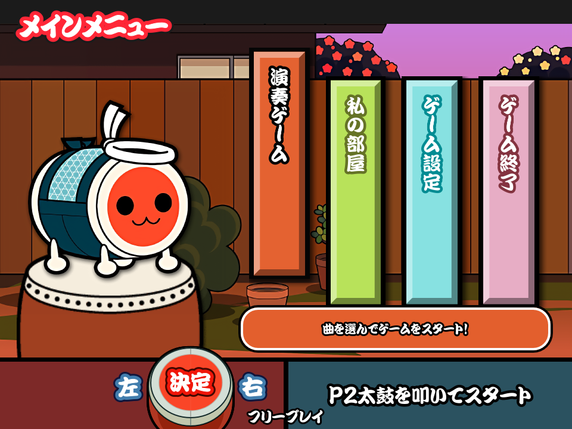
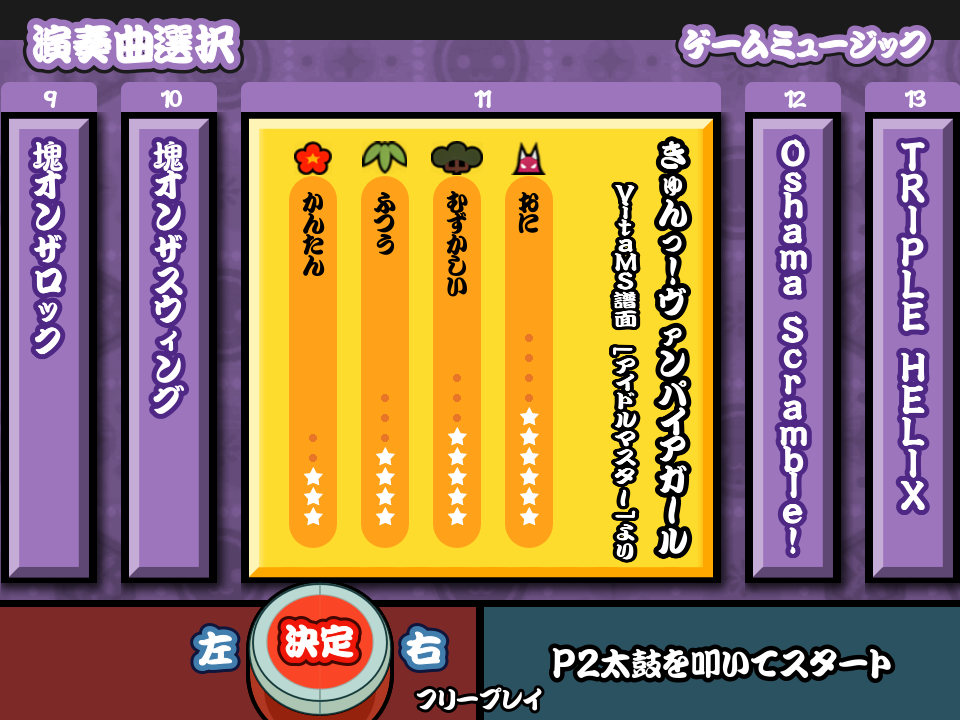

# 太鼓さん十四

Cross platform Gen-2 based TJA player and Taiko simulator powered by [Godot](https://godotengine.org/).

[In-Game](https://github.com/user-attachments/assets/937677c0-e302-4dc2-8230-f9017e9307fb)

  
  

# Features

- Cross platform (Windows, Linux, Mac, basically supports anything that Godot can run on)
- High-performance and should run on a shitty iGPU with Vulkan support (like mine!)
- Low latency input
- Can run (most) 太鼓さん次郎 charts (including gimmick charts[^1])
- 4:3 720p, with an aesthetic similar to Gen 2 Taiko (7-14), the Wii and Portable games

[^1]: Gimmick charts that abuse certain TaikoJiro quirks aren't supported yet and don't play properly.

# Controls

Currently only supports keyboard...

- DFJK for the Taiko itself (P1) (left kat, left don, right don, right kat)
- ERUI for the Player 2 Taiko (WIP; will crash when selected on the entry screen!)
- SPACE to pause the game and start the game after the notice screen

# FAQ

> What Taiko arcade release is this supposed to emulate?

None of them. Or more like all of them, since its an amalgamation of Generation 2 style Taiko in general.

> Are there any plans to make this more accurate to Taiko 14?

No.

> My sound doesn't work!

I'm primarily working on this on Linux, and so by default in the Project Settings, the sound driver I chose is ALSA.
If you're on Windows or Mac, it should change to a different one, though feel free to change it to WASAPI for minimum latency. (Just don't put this on pull requests or something...)

# Contributing

Contributions are very much welcome! I'm more or so looking for more contributions on the art asset side, as I'm redrawing Gen 2 assets for 720p.

## Requirements

For development of the actual game:

- [Godot 4.6+](https://godotengine.org/)
  - Redot or other Godot forks not supported

For art assets (as seen on the `art-assets/` folder):
- [Inkscape](https://inkscape.org/)

# Notes

These aren't rules per se, though please still follow these when making contributions.

- When making commit messages, please follow [Conventional Commits](https://www.conventionalcommits.org/en/v1.0.0/).
  - The message itself must atleast show what the commit does, but can be anything else otherwise
	- e.g. (`fix: annoying bug fuuuuck`)
  - Available scopes include `main`, `ui`, and `tja`, which handles main gameplay, menus/ui, and the TJA parser respectively.
	- These are not needed, though are included for clearness (I will also use this myself, soon!)
- Any contributions regarding art assets must be 720p.
  - If possible, if you're using Inkscape to create the assets, please provide the Inkscape SVG file as well.
- No AI generated contributions please.

# License

Licensed under MIT.
